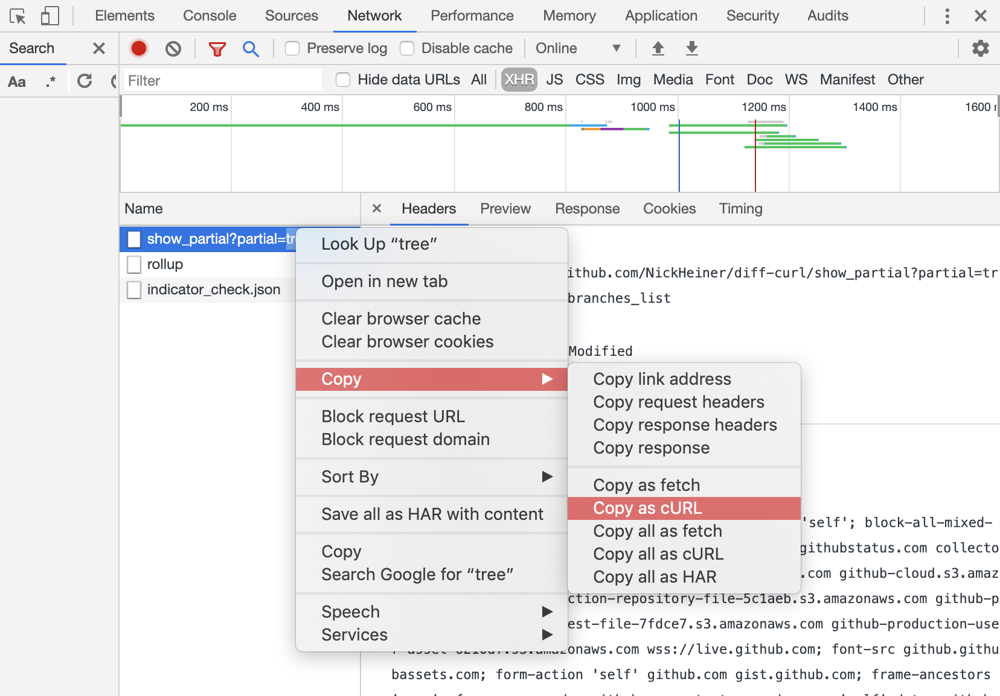

# diff-curl
> Pretty-print the diff between two CURL commands.

**Why:** It's hard to visually diff two requests in the Chrome network tools. Use this instead.

## How To Use
1. Find the two requests you want to compare in the Chrome network tools.
2. Copy them both "as cURL":

3. Save them locally to files like `good-request.bash` and `bad-request.bash`.
4. Run this tool: `diff-curl good-request.bash bad-request.bash`.
5. Sample output (this is a closeup of the section comparing the querystring params):
